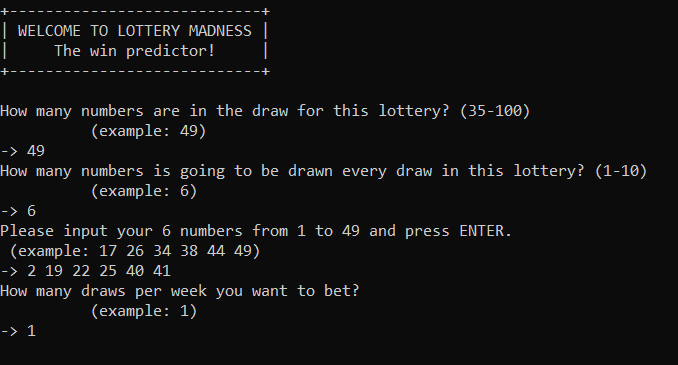
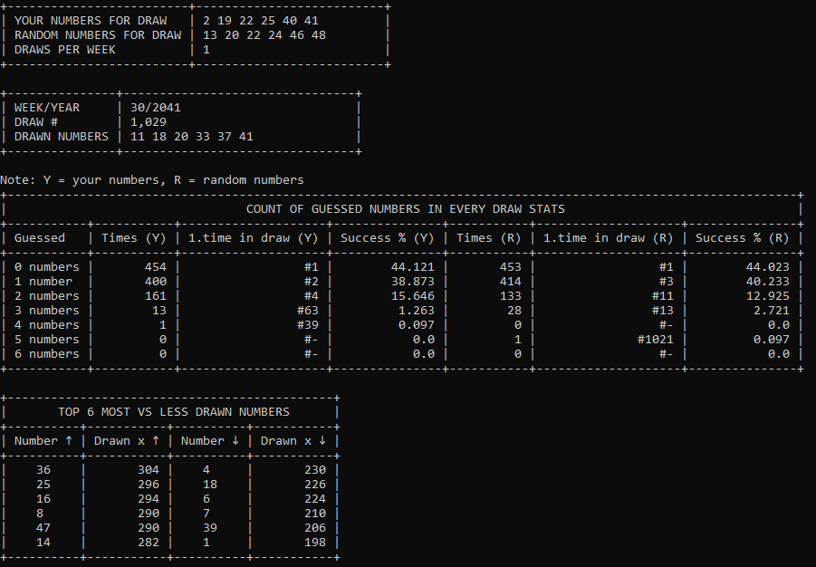

<h1>LOTTERY WIZARD</h1>

Have you ever bet in some lottery and thought about how probable is your win?
Now you can see it crystal clear -  what are your chances to win?

By simple configuration in the begining you create "your own" lottery. 
Then you just need to put your "winning" numbers and let's go!

In the text-visualized form you can also see how many times and how many numbers 
have you hit in every draw and also the chart of most drawn numbers - so maybe you could
choose those the next time! ;)

<I>The tool is available in English and Slovak language</I>

<h1>How to run? (Windows)</h1>

pre-condition: Python 3.7 or higher installed

1. clone this repo 
2. run 'run-me'.bat 
